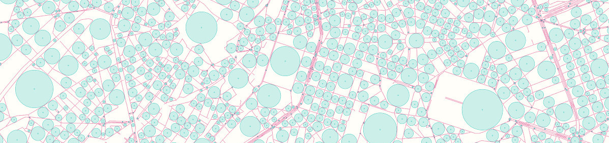

## How to make a "Retreats from Streets" map

This tutorial will show you how to calculate the furthest distance away from streets within [city blocks](https://en.wikipedia.org/wiki/City_block) i.e. areas completely surrounded by streets. The final data can be used to make interactive maps like e.g. [this](https://hanshack.com/rueckzugsorte/) or this [this](https://hanshack.com/retreats/brussels).



### Requirements
* Some basic knowledge of PostgreSQL/PostGIS
* Some basic knowledge of how to run a Node.js script
* You need to know how to import OpenStreetMap data to PostgreSQL/PostGIS (with e.g. osm2pgsql)
* Some understanding of OpenStreetMap data and Javascript is useful if you want to make changes to the queries and code.


### Main steps
1. Import OSM data
2. Compute city blocks - run some SQL queries
3. Compute furthest place away from streets for each city block - run a Node.js script

##### 1. Import OpenStreetMap data
Get some OSM data from e.g. [Geofabrik](http://download.geofabrik.de/) and import it to PostgreSQL. I used osm2pgsql to import the file **belgium-latest.osm.pbf** which includes all the OSM data for Belgium.


##### 2. Compute the city blocks
We have to run several SQL queries to compute the city blocks. I broke them down to several queries so its easier to understand whats going on. 


1. Select an area of interest (in this example I chose Brussels)


```sql
DROP TABLE IF EXISTS city_polygon;
CREATE TABLE city_polygon(cgeom geometry);

INSERT INTO city_polygon (
  SELECT ST_Union(way)
  FROM planet_osm_polygon
  WHERE name = 'Région de Bruxelles-Capitale - Brussels Hoofdstedelijk Gewest'
);
``` 

2. Buffer the area of interest by about 2000 meters. This will be useful later on so we do not have to run calculations on stuff we are not interested in.

```sql
DROP TABLE IF EXISTS city_polygon_buffer;
CREATE TABLE city_polygon_buffer (cgeom geometry);

INSERT INTO city_polygon_buffer (
  SELECT
   ST_Transform(
      ST_Buffer(
        ST_Transform(cgeom,4326)::geography,
        2000
      )::geometry
      ,3857)
  FROM city_polygon
);
``` 

3. Select all the streets that are allowed for cars within our buffered area of interest. This would also be the place where to include other roads types and/or train tracks etc.

```sql
DROP TABLE IF EXISTS streets;
CREATE TABLE streets (sgeom geometry);

INSERT INTO streets (
  SELECT way
    FROM planet_osm_line,city_polygon_buffer
    WHERE 
        (highway='motorway' or highway='motorway_link'or
        highway='trunk' or highway='trunk_link'or
        highway='primary' or highway='primary_link'or
        highway='secondary' or highway='secondary_link'or
        highway='tertiary' or highway='tertiary_link'or
        highway='unclassified' or highway='unclassified_link'or
        highway='residential' or highway='residential_link'or
        highway='living_street') AND (tunnel NOT IN ('yes') or tunnel IS NULL)
        AND ST_Intersects( way , cgeom )
);

``` 

4. Buffer the streets by 1.3 meters so they will be 2.6 meters wide (the max permitted width for cars in Europe) and union them to one big polygon.


```sql
DROP TABLE IF EXISTS streets_union;
CREATE TABLE streets_union (sgeom geometry);

INSERT INTO streets_union (
  SELECT ST_Union(
      ST_Transform(
      ST_Buffer(ST_Transform(sgeom,4326)::geography,1.3)::geometry
        ,3857)
  )
  FROM streets
);
``` 

5. Intersect the streets with the city polygon to make the city blocks. Then only select the blocks that are intersecting (within and partly within) the city polygon. A primary key is also added to the bocks for later use.

```sql
DROP TABLE IF EXISTS city_blocks;
CREATE TABLE city_blocks (pgeom geometry);
WITH

blocks AS (
  SELECT (ST_Dump(ST_SymDifference(cgeom,sgeom))).geom AS bgeom
  FROM city_polygon_buffer,streets_union
)

INSERT INTO city_blocks (
  SELECT bgeom
  FROM city_polygon,blocks
  WHERE ST_Intersects( cgeom , bgeom )
);

ALTER TABLE city_blocks ADD COLUMN id SERIAL PRIMARY KEY;

```

6. Add the following function called I_Grid_Point_Distance which allows you to make point grids within a polygon. We need this later on. I luckily found this function on [gis.stackexchange.com]( https://gis.stackexchange.com/questions/4663/how-to-create-regular-point-grid-inside-a-polygon-in-postgis).

```sql
CREATE OR REPLACE FUNCTION public.I_Grid_Point_Distance(geom public.geometry, x_side decimal, y_side decimal)
RETURNS public.geometry AS $BODY$
DECLARE
x_min decimal;
x_max decimal;
y_max decimal;
x decimal;
y decimal;
returnGeom public.geometry[];
i integer := -1;
srid integer := 4326;
input_srid integer;
BEGIN
CASE st_srid(geom) WHEN 0 THEN
  geom := ST_SetSRID(geom, srid);
      ----RAISE NOTICE 'No SRID Found.';
  ELSE
      ----RAISE NOTICE 'SRID Found.';
END CASE;
  input_srid:=st_srid(geom);
  geom := st_transform(geom, srid);
  x_min := ST_XMin(geom);
  x_max := ST_XMax(geom);
  y_max := ST_YMax(geom);
  y := ST_YMin(geom);
  x := x_min;
  i := i + 1;
  returnGeom[i] := st_setsrid(ST_MakePoint(x, y), srid);
<<yloop>>
LOOP
IF (y > y_max) THEN
  EXIT;
END IF;

CASE i WHEN 0 THEN 
  y := ST_Y(returnGeom[0]);
ELSE 
  y := ST_Y(ST_Project(st_setsrid(ST_MakePoint(x, y), srid), y_side, radians(0))::geometry);
END CASE;

x := x_min;
<<xloop>>
LOOP
IF (x > x_max) THEN
    EXIT;
END IF;
  i := i + 1;
  returnGeom[i] := st_setsrid(ST_MakePoint(x, y), srid);
  x := ST_X(ST_Project(st_setsrid(ST_MakePoint(x, y), srid), x_side, radians(90))::geometry);
END LOOP xloop;
END LOOP yloop;
RETURN
ST_CollectionExtract(st_transform(ST_Intersection(st_collect(returnGeom), geom), input_srid), 1);
END;
$BODY$ LANGUAGE plpgsql IMMUTABLE;`
```


##### 3. Compute furthest place away from streets for each city block

Since I'm not a PostgreSQL expert, I wrote a Node.js script which loops through the city blocks you just created in step two. A point grid by 5x5 meters is laid out within each city block (with the I_Grid_Point_Distance function you added earlier). Then the furthest point away from the polygon outline is queried (the outline is where the street starts). 

The script will add a table to your databank with the furthest points from a street for each block. An additional table with circles is also added which have the points as their center and a radius with the maximum distance to the street.

Note: Before you run the script, remember to install the dependencies and edit the connection settings to your DB which can be done in the ***index.js*** file. You can find the script in this repo.

Good luck and please let me know if you made some nice maps!


